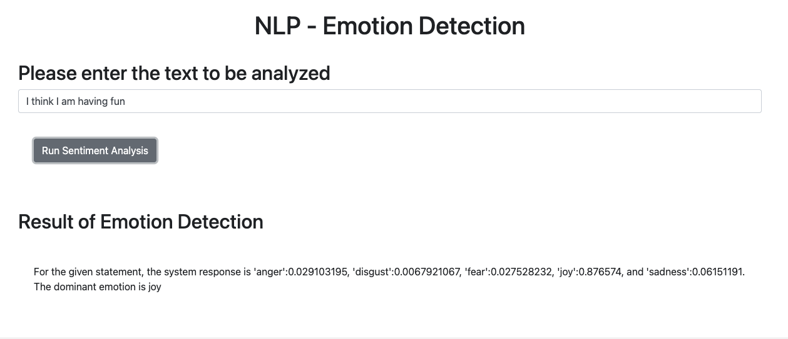
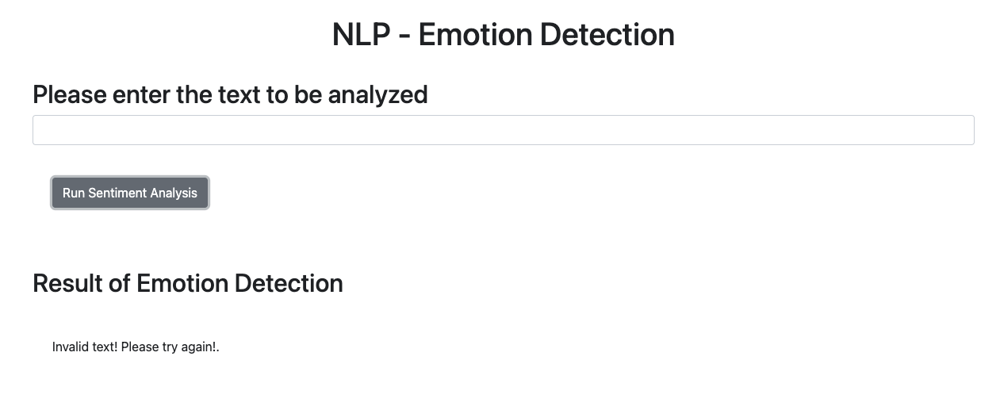

# 🤖💬 EmotionSense: AI-Powered Customer Feedback Analytics

---

## Project Overview

Welcome to **EmotionSense**! This project showcases an advanced AI-based web application designed for e-commerce companies to perform in-depth analytics on customer feedback. Moving beyond simple sentiment analysis, EmotionSense leverages powerful AI to **detect nuanced emotions** like joy, sadness, anger, and more from raw text feedback. This capability is crucial for businesses aiming to truly understand their customers and enhance their products and services.

This application was developed as a final project, demonstrating proficiency in full-stack web application development, AI integration, and deployment strategies.

## ✨ Features

* **Emotion Detection:** Utilizes Watson AI libraries to accurately identify a spectrum of emotions from customer text feedback.
* **Intuitive Web Interface:** A user-friendly web application built with **Flask**, **HTML**, and **JavaScript** for seamless interaction.
* **Real-time Analysis:** Provides immediate insights into customer sentiment, enabling quick decision-making.
* **Scalable Architecture:** Designed to handle increasing volumes of customer feedback.

## 🚀 Technologies Used

* **Python (Flask):** For the backend web framework, handling requests and integrating with AI services.
* **HTML & CSS:** For structuring and styling the web application's user interface.
* **JavaScript:** For dynamic client-side interactions and enhancing user experience.
* **IBM Watson AI Libraries:** The core AI engine powering the emotion detection capabilities.

## 💡 Why Emotion Detection Matters

In today's competitive landscape, understanding the "why" behind customer feedback is paramount. Emotion detection provides a deeper layer of insight than traditional sentiment analysis. By identifying specific emotions, businesses can:

* **Refine Product Development:** Pinpoint features that evoke strong positive or negative emotions.
* **Improve Customer Service:** Understand the emotional state of customers to tailor support interactions.
* **Enhance Marketing Strategies:** Craft campaigns that resonate with specific emotional responses.
* **Build Stronger Relationships:** Show customers that their nuanced feelings are recognized and valued.

---

## 🛠️ Installation & Setup

To run EmotionSense locally, follow these steps:

1.  **Clone the repository:**
    ```bash
    mkdir EmotionSense
    git clone https://github.com/jivfur/oaqjp-final-project-emb-ai.git EmotionSense
    cd EmotionSense
    ```
2.  **Create a virtual environment (recommended):**
    ```bash
    python -m venv venv
    source venv/bin/activate # On Windows: .\venv\Scripts\activate
    ```
3.  **Install dependencies:**
    ```bash
    pip install -r requirements.txt
    ```
4.  **Configure IBM Watson AI:**
    * You'll need an IBM Cloud account and access to the Watson Natural Language Understanding (or similar emotion detection) service.
    * Obtain your **API Key** and **Service URL**.
    * Create a `.env` file in the root directory of the project and add your credentials:
        ```
        WATSON_API_KEY=YOUR_WATSON_API_KEY
        WATSON_SERVICE_URL=YOUR_WATSON_SERVICE_URL
        ```
        (Note: The exact environment variable names might vary based on the specific Watson service integration. Please check the `app.py` or relevant backend files for the precise variable names expected by the code.)
5.  **Run the Flask application:**
    ```bash
    flask run
    ```
    The application will typically be available at `http://127.0.0.1:5000/`.

---

## 📸 Screenshots

*(To be added after deployment/local testing)*

Here you would include screenshots showcasing the application's interface, text input, and the displayed emotion analysis results.
For example:

* **Homepage/Input Screen:**
    
    *A clean interface for users to submit their feedback text.*

* **Emotion Analysis Results:**
    
    *Displaying the detected emotions (e.g., joy, sadness, anger) and their corresponding confidence scores.*

---

## 📄 License

This project is licensed under the MIT License. See the `LICENSE` file for more details.

---

## 📞 Contact

Feel free to reach out if you have any questions or feedback!
